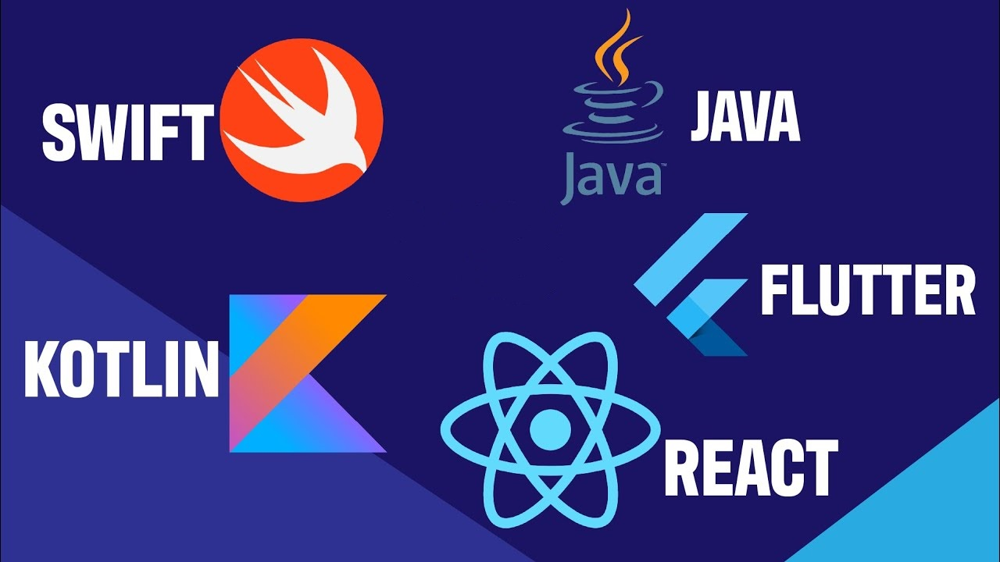

# Meu Portfólio 🖥️

repositório criado com o intuito de guardar as minhas conquistas e evolução 🙂

Quero aprender o maxímo de coisas possíveis sobre desenvolvimento mobile e trabalhar com isso

 - [GitHub](https://github.com/VictorHugo0709)
 - [DIO](https://web.dio.me/users/victorhugo070904?tab=achievements)
 - [Linkedin](https://www.linkedin.com/in/victor-hugo-santos-garcia-4a86b421a/)
 - [Reddit](https://www.reddit.com/user/VictorHugo0709)

## Sites Úteis:

 - [Jet Brains](https://www.jetbrains.com/pt-br/)
 - [Stack Overflow](https://stackoverflow.com/)
 - [Small Dev Tools](https://smalldev.tools/)
 - [DEVICON](https://devicon.dev/)
 - [Badgen](https://badgen.net/)
 - [EmojiPedia](https://emojipedia.org/)
 - [Shields.io](https://shields.io/)
 - [github-readme-stats](https://github.com/anuraghazra/github-readme-stats)
 - [github-readme-stats (PT-BR)](https://github.com/anuraghazra/github-readme-stats/blob/master/docs/readme_pt-BR.md)

